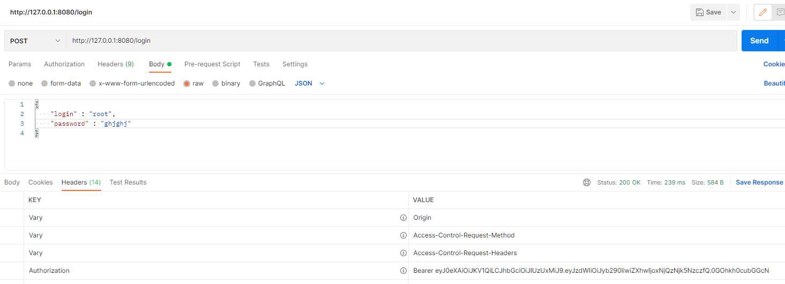
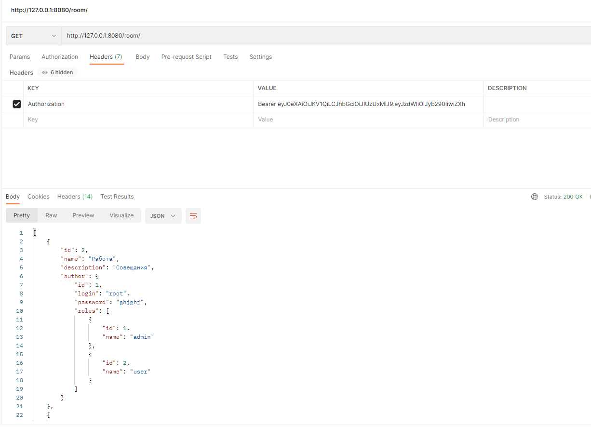

Chat
====================================================
Project: Simple chat (with rooms) service.
----------------------------------------------------
User registration is available. After registration, it is possible
to get information of rooms, send messages. 
The project uses Spring boot, JWT authorization, Hibernate.

Configuration
----------------------------------------------------
The project should be configured the Spring Boot.

Usage
----------------------------------------------------
- 1.Registration.
- req. POST /users/sign-up
body: {
       "login": "site.ru",
       "password" : "Password"
       }
- 2.Authorisation.
POST /login
body: {
       "login" : "site.ru",
       "password" : "Password"       
       }
"Authorization" = "Bearer XXXXXX";
- 3.Rooms
Get /room/
Get /room/id
- 4.Messages
Get /message/
Get /message/id
Post /message/
body: {
       "text" : "text",
       "author" : "author",
       "room" : "room"       
       }

